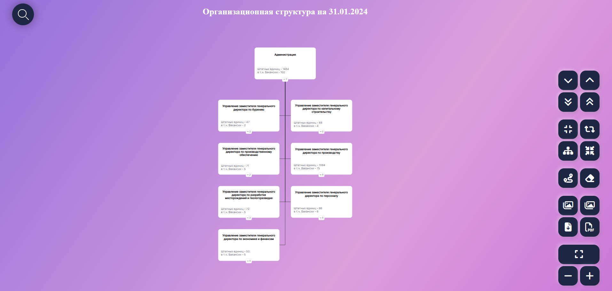
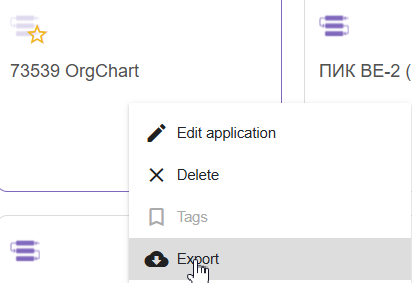
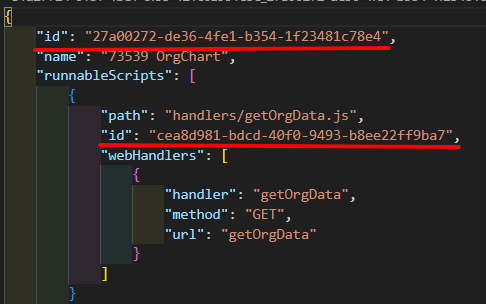
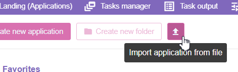

# [Постановка задачи](https://rucom.optimacros.com/post/271376)

# [ТЗ и источники данных](https://notes.optimacros.com/pages/viewpage.action?pageId=11080158&flashId=518817949)

# [Ссылка на приложение](https://am11.optimacros.com/app/27a00272-de36-4fe1-b354-1f23481c78e4/orgChart.html)

# Для подключения новой модели:

-   в файле `env.js` заполнить данные для подключения к модели/токен и источники данных модели
-   в файле `properties.js` заполнить переменные `PROPERTIES`, где `PROPERTY_` - это наименование видимое в карточке, `CUBE_PROPERTY_` - это наименование колонки из МК источника данных, и `mainNodeId` - longId корневого элемента (верхний уровень).
-   в мультикубе с исходными данными должно быть преднастроено view: строки - наименование узлов одномерное, столбцы - наименования параметров для отображения и тех.данные
-   для переноса приложения на другой сервер:

1. Необходимо экспортировать приложение

    

2. В скаченном архиве заменить в файле `.omapp.json` все `id` на сгенерированные uuid (например https://www.uuidgenerator.net/)

    

3. Импортировать приложение с указанием на интересующий архив приложения

    
